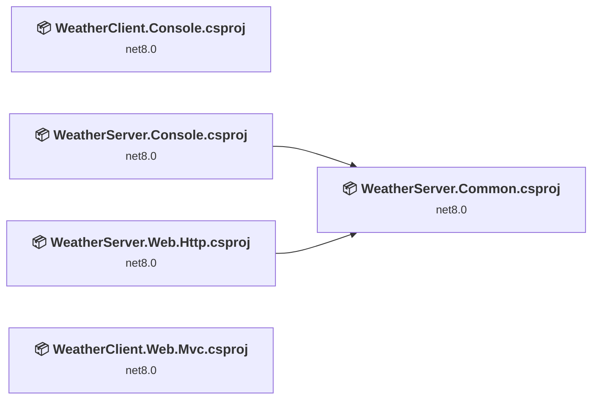
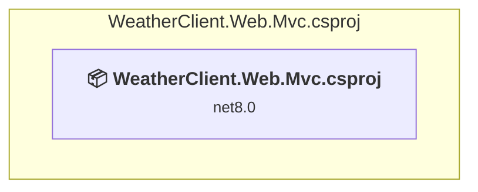
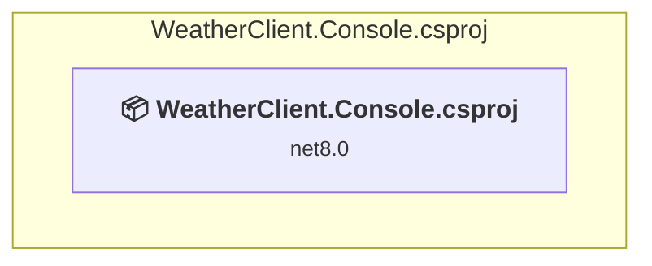
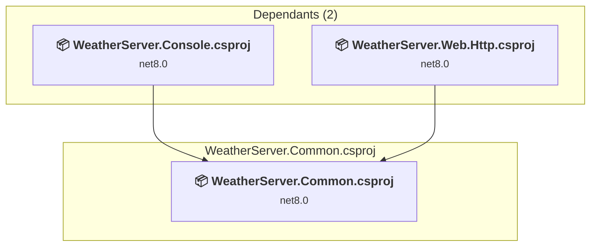
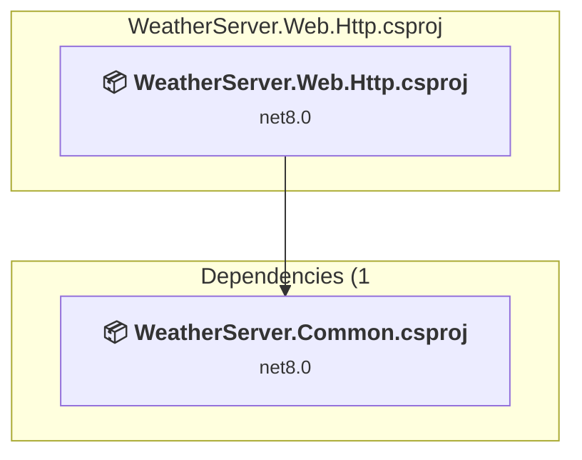
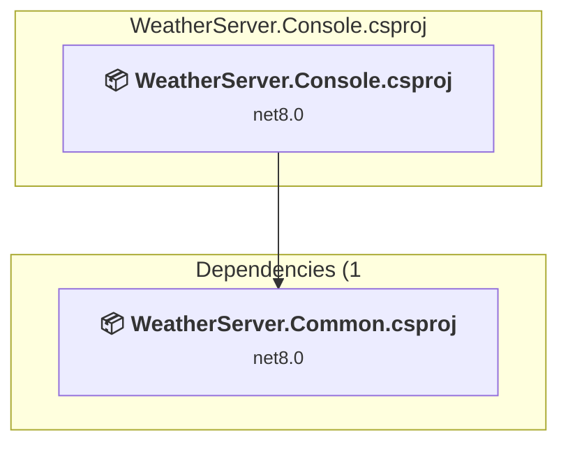

# Projects and dependencies analysis

This document provides a comprehensive overview of the projects and their dependencies in the context of upgrading to .NETCoreApp,Version=v10.0.

## Table of Contents

- [Executive Summary](#executive-Summary)
  - [Highlevel Metrics](#highlevel-metrics)
  - [Projects Compatibility](#projects-compatibility)
  - [Package Compatibility](#package-compatibility)
  - [API Compatibility](#api-compatibility)
- [Aggregate NuGet packages details](#aggregate-nuget-packages-details)
- [Top API Migration Challenges](#top-api-migration-challenges)
  - [Technologies and Features](#technologies-and-features)
  - [Most Frequent API Issues](#most-frequent-api-issues)
- [Projects Relationship Graph](#projects-relationship-graph)
- [Project Details](#project-details)

  - [WeatherClient.Mvc\WeatherClient.Web.Mvc.csproj](#weatherclientmvcweatherclientwebmvccsproj)
  - [WeatherClient\WeatherClient.Console.csproj](#weatherclientweatherclientconsolecsproj)
  - [WeatherServer.Common\WeatherServer.Common.csproj](#weatherservercommonweatherservercommoncsproj)
  - [WeatherServer.Http\WeatherServer.Web.Http.csproj](#weatherserverhttpweatherserverwebhttpcsproj)
  - [WeatherServer\WeatherServer.Console.csproj](#weatherserverweatherserverconsolecsproj)

## Executive Summary

### Highlevel Metrics

| Metric | Count | Status |
| :--- | :---: | :--- |
| Total Projects | 5 | All require upgrade |
| Total NuGet Packages | 10 | 3 need upgrade |
| Total Code Files | 25 |  |
| Total Code Files with Incidents | 15 |  |
| Total Lines of Code | 1408 |  |
| Total Number of Issues | 60 |  |
| Estimated LOC to modify | 48+ | at least 3.4% of codebase |

### Projects Compatibility

| Project | Target Framework | Difficulty | Package Issues | API Issues | Est. LOC Impact | Description |
| :--- | :---: | :---: | :---: | :---: | :---: | :--- |
| [WeatherClient.Mvc\WeatherClient.Web.Mvc.csproj](#weatherclientmvcweatherclientwebmvccsproj) | net8.0 | 🟢 Low | 1 | 5 | 5+ | AspNetCore, Sdk Style = True |
| [WeatherClient\WeatherClient.Console.csproj](#weatherclientweatherclientconsolecsproj) | net8.0 | 🟢 Low | 1 | 4 | 4+ | DotNetCoreApp, Sdk Style = True |
| [WeatherServer.Common\WeatherServer.Common.csproj](#weatherservercommonweatherservercommoncsproj) | net8.0 | 🟢 Low | 2 | 7 | 7+ | ClassLibrary, Sdk Style = True |
| [WeatherServer.Http\WeatherServer.Web.Http.csproj](#weatherserverhttpweatherserverwebhttpcsproj) | net8.0 | 🟢 Low | 1 | 19 | 19+ | AspNetCore, Sdk Style = True |
| [WeatherServer\WeatherServer.Console.csproj](#weatherserverweatherserverconsolecsproj) | net8.0 | 🟢 Low | 2 | 13 | 13+ | DotNetCoreApp, Sdk Style = True |

### Package Compatibility

| Status | Count | Percentage |
| :--- | :---: | :---: |
| ✅ Compatible | 7 | 70.0% |
| ⚠️ Incompatible | 0 | 0.0% |
| 🔄 Upgrade Recommended | 3 | 30.0% |
| ***Total NuGet Packages*** | ***10*** | ***100%*** |

### API Compatibility

| Category | Count | Impact |
| :--- | :---: | :--- |
| 🔴 Binary Incompatible | 0 | High - Require code changes |
| 🟡 Source Incompatible | 0 | Medium - Needs re-compilation and potential conflicting API error fixing |
| 🔵 Behavioral change | 48 | Low - Behavioral changes that may require testing at runtime |
| ✅ Compatible | 2884 |  |
| ***Total APIs Analyzed*** | ***2932*** |  |

## Aggregate NuGet packages details

| Package | Current Version | Suggested Version | Projects | Description |
| :--- | :---: | :---: | :--- | :--- |
| Anthropic.SDK | 5.5.1 |  | [WeatherClient.Console.csproj](#weatherclientweatherclientconsolecsproj) [WeatherClient.Web.Mvc.csproj](#weatherclientmvcweatherclientwebmvccsproj) [WeatherServer.Web.Http.csproj](#weatherserverhttpweatherserverwebhttpcsproj) | ✅Compatible |
| Microsoft.Extensions.AI | 9.9.0 |  | [WeatherClient.Console.csproj](#weatherclientweatherclientconsolecsproj) [WeatherClient.Web.Mvc.csproj](#weatherclientmvcweatherclientwebmvccsproj) [WeatherServer.Web.Http.csproj](#weatherserverhttpweatherserverwebhttpcsproj) | ✅Compatible |
| Microsoft.Extensions.Hosting | 10.0.0-preview.6.25358.103 | 10.0.5 | [WeatherClient.Console.csproj](#weatherclientweatherclientconsolecsproj) [WeatherClient.Web.Mvc.csproj](#weatherclientmvcweatherclientwebmvccsproj) [WeatherServer.Common.csproj](#weatherservercommonweatherservercommoncsproj) [WeatherServer.Console.csproj](#weatherserverweatherserverconsolecsproj) [WeatherServer.Web.Http.csproj](#weatherserverhttpweatherserverwebhttpcsproj) | NuGet package upgrade is recommended |
| Microsoft.Extensions.Http | 8.0.0 | 10.0.5 | [WeatherServer.Common.csproj](#weatherservercommonweatherservercommoncsproj) | NuGet package upgrade is recommended |
| Microsoft.Extensions.Http | 9.0.9 | 10.0.5 | [WeatherServer.Console.csproj](#weatherserverweatherserverconsolecsproj) | NuGet package upgrade is recommended |
| ModelContextProtocol | 0.2.0-preview.3 |  | [WeatherClient.Console.csproj](#weatherclientweatherclientconsolecsproj) | ✅Compatible |
| ModelContextProtocol | 0.3.0-preview.2 |  | [WeatherClient.Web.Mvc.csproj](#weatherclientmvcweatherclientwebmvccsproj) [WeatherServer.Common.csproj](#weatherservercommonweatherservercommoncsproj) [WeatherServer.Console.csproj](#weatherserverweatherserverconsolecsproj) [WeatherServer.Web.Http.csproj](#weatherserverhttpweatherserverwebhttpcsproj) | ✅Compatible |
| ModelContextProtocol.AspNetCore | 0.3.0-preview.2 |  | [WeatherServer.Web.Http.csproj](#weatherserverhttpweatherserverwebhttpcsproj) | ✅Compatible |
| Swashbuckle.AspNetCore | 9.0.6 |  | [WeatherClient.Web.Mvc.csproj](#weatherclientmvcweatherclientwebmvccsproj) [WeatherServer.Web.Http.csproj](#weatherserverhttpweatherserverwebhttpcsproj) | ✅Compatible |
| Swashbuckle.AspNetCore.SwaggerUI | 9.0.6 |  | [WeatherClient.Web.Mvc.csproj](#weatherclientmvcweatherclientwebmvccsproj) [WeatherServer.Web.Http.csproj](#weatherserverhttpweatherserverwebhttpcsproj) | ✅Compatible |

## Top API Migration Challenges

### Technologies and Features

| Technology | Issues | Percentage | Migration Path |
| :--- | :---: | :---: | :--- |

### Most Frequent API Issues

| API | Count | Percentage | Category |
| :--- | :---: | :---: | :--- |
| T:System.Uri | 24 | 50.0% | Behavioral Change |
| M:System.Uri.#ctor(System.String) | 10 | 20.8% | Behavioral Change |
| M:Microsoft.Extensions.DependencyInjection.HttpClientFactoryServiceCollectionExtensions.AddHttpClient(Microsoft.Extensions.DependencyInjection.IServiceCollection,System.String,System.Action{System.Net.Http.HttpClient}) | 6 | 12.5% | Behavioral Change |
| M:Microsoft.Extensions.Logging.ConsoleLoggerExtensions.AddConsole(Microsoft.Extensions.Logging.ILoggingBuilder,System.Action{Microsoft.Extensions.Logging.Console.ConsoleLoggerOptions}) | 4 | 8.3% | Behavioral Change |
| M:Microsoft.AspNetCore.Builder.ExceptionHandlerExtensions.UseExceptionHandler(Microsoft.AspNetCore.Builder.IApplicationBuilder,System.String) | 1 | 2.1% | Behavioral Change |
| T:System.Net.Http.HttpContent | 1 | 2.1% | Behavioral Change |
| M:System.Net.Http.HttpContent.ReadAsStreamAsync | 1 | 2.1% | Behavioral Change |
| T:System.Text.Json.JsonDocument | 1 | 2.1% | Behavioral Change |

## Projects Relationship Graph

Legend:
📦 SDK-style project
⚙️ Classic project

## Project Details

### WeatherClient.Mvc\WeatherClient.Web.Mvc.csproj

#### Project Info

- **Current Target Framework:** net8.0
- **Proposed Target Framework:** net10.0
- **SDK-style**: True
- **Project Kind:** AspNetCore
- **Dependencies**: 0
- **Dependants**: 0
- **Number of Files**: 17
- **Number of Files with Incidents**: 3
- **Lines of Code**: 458
- **Estimated LOC to modify**: 5+ (at least 1.1% of the project)

#### Dependency Graph

Legend:
📦 SDK-style project
⚙️ Classic project

### API Compatibility

| Category | Count | Impact |
| :--- | :---: | :--- |
| 🔴 Binary Incompatible | 0 | High - Require code changes |
| 🟡 Source Incompatible | 0 | Medium - Needs re-compilation and potential conflicting API error fixing |
| 🔵 Behavioral change | 5 | Low - Behavioral changes that may require testing at runtime |
| ✅ Compatible | 1633 |  |
| ***Total APIs Analyzed*** | ***1638*** |  |

### WeatherClient\WeatherClient.Console.csproj

#### Project Info

- **Current Target Framework:** net8.0
- **Proposed Target Framework:** net10.0
- **SDK-style**: True
- **Project Kind:** DotNetCoreApp
- **Dependencies**: 0
- **Dependants**: 0
- **Number of Files**: 1
- **Number of Files with Incidents**: 2
- **Lines of Code**: 161
- **Estimated LOC to modify**: 4+ (at least 2.5% of the project)

#### Dependency Graph

Legend:
📦 SDK-style project
⚙️ Classic project

### API Compatibility

| Category | Count | Impact |
| :--- | :---: | :--- |
| 🔴 Binary Incompatible | 0 | High - Require code changes |
| 🟡 Source Incompatible | 0 | Medium - Needs re-compilation and potential conflicting API error fixing |
| 🔵 Behavioral change | 4 | Low - Behavioral changes that may require testing at runtime |
| ✅ Compatible | 231 |  |
| ***Total APIs Analyzed*** | ***235*** |  |

### WeatherServer.Common\WeatherServer.Common.csproj

#### Project Info

- **Current Target Framework:** net8.0
- **Proposed Target Framework:** net10.0
- **SDK-style**: True
- **Project Kind:** ClassLibrary
- **Dependencies**: 0
- **Dependants**: 2
- **Number of Files**: 7
- **Number of Files with Incidents**: 5
- **Lines of Code**: 453
- **Estimated LOC to modify**: 7+ (at least 1.5% of the project)

#### Dependency Graph

Legend:
📦 SDK-style project
⚙️ Classic project

### API Compatibility

| Category | Count | Impact |
| :--- | :---: | :--- |
| 🔴 Binary Incompatible | 0 | High - Require code changes |
| 🟡 Source Incompatible | 0 | Medium - Needs re-compilation and potential conflicting API error fixing |
| 🔵 Behavioral change | 7 | Low - Behavioral changes that may require testing at runtime |
| ✅ Compatible | 507 |  |
| ***Total APIs Analyzed*** | ***514*** |  |

### WeatherServer.Http\WeatherServer.Web.Http.csproj

#### Project Info

- **Current Target Framework:** net8.0
- **Proposed Target Framework:** net10.0
- **SDK-style**: True
- **Project Kind:** AspNetCore
- **Dependencies**: 1
- **Dependants**: 0
- **Number of Files**: 6
- **Number of Files with Incidents**: 3
- **Lines of Code**: 289
- **Estimated LOC to modify**: 19+ (at least 6.6% of the project)

#### Dependency Graph

Legend:
📦 SDK-style project
⚙️ Classic project

### API Compatibility

| Category | Count | Impact |
| :--- | :---: | :--- |
| 🔴 Binary Incompatible | 0 | High - Require code changes |
| 🟡 Source Incompatible | 0 | Medium - Needs re-compilation and potential conflicting API error fixing |
| 🔵 Behavioral change | 19 | Low - Behavioral changes that may require testing at runtime |
| ✅ Compatible | 411 |  |
| ***Total APIs Analyzed*** | ***430*** |  |

### WeatherServer\WeatherServer.Console.csproj

#### Project Info

- **Current Target Framework:** net8.0
- **Proposed Target Framework:** net10.0
- **SDK-style**: True
- **Project Kind:** DotNetCoreApp
- **Dependencies**: 1
- **Dependants**: 0
- **Number of Files**: 1
- **Number of Files with Incidents**: 2
- **Lines of Code**: 47
- **Estimated LOC to modify**: 13+ (at least 27.7% of the project)

#### Dependency Graph

Legend:
📦 SDK-style project
⚙️ Classic project

### API Compatibility

| Category | Count | Impact |
| :--- | :---: | :--- |
| 🔴 Binary Incompatible | 0 | High - Require code changes |
| 🟡 Source Incompatible | 0 | Medium - Needs re-compilation and potential conflicting API error fixing |
| 🔵 Behavioral change | 13 | Low - Behavioral changes that may require testing at runtime |
| ✅ Compatible | 102 |  |
| ***Total APIs Analyzed*** | ***115*** |  |

