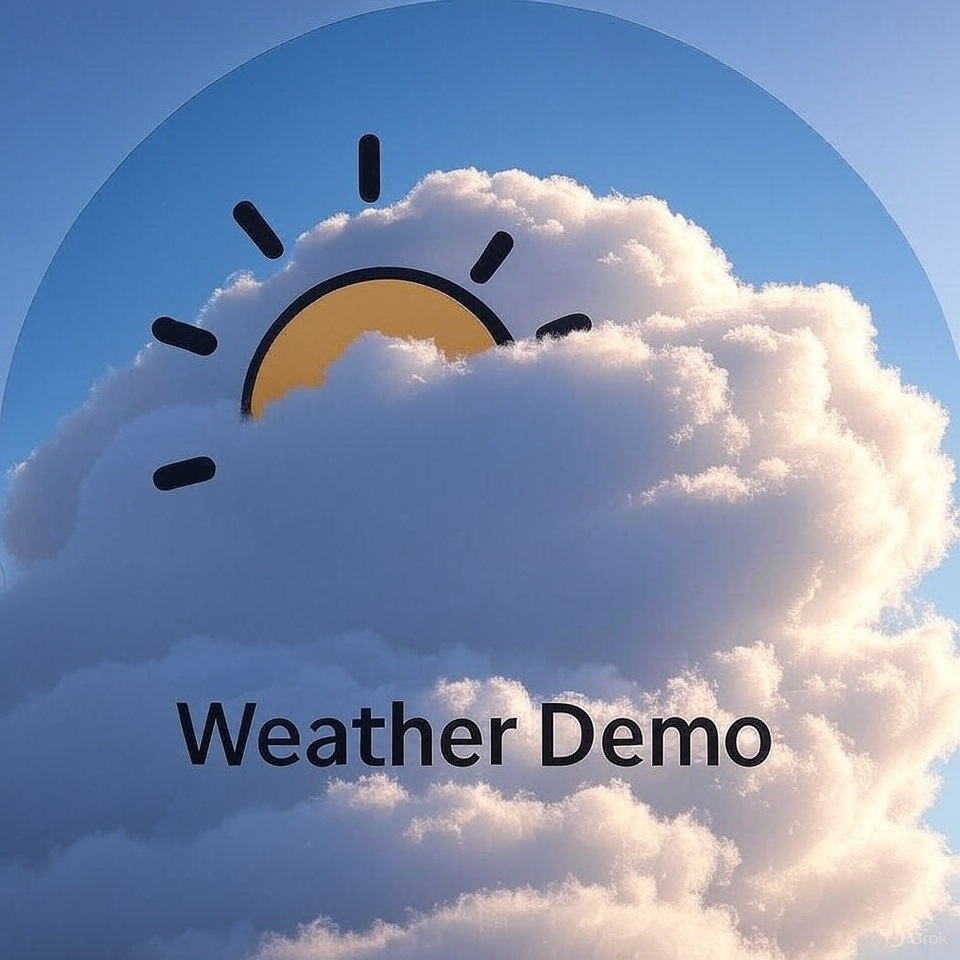

# WeatherMcpDemo

WeatherMcpDemo is a .NET 8 Razor Pages solution for retrieving, processing, and displaying weather data from multiple sources. It demonstrates modular design, extensibility, and integration with external APIs, focusing on clean separation of concerns and maintainability.

## Features

- Fetches weather data from the National Weather Service ([api.weather.gov](https://api.weather.gov))
- Supports weather alerts by state and weather forecasts for US locations
- Integrates with additional providers (Yr, Nominatim)
- Processes and formats weather information for display
- Presents results in a simple, user-friendly Razor Pages interface
- Extensible architecture for adding new weather sources
- Sample code for API client management and secrets handling

## Solution Structure

- `src/` - Main source code
- `Readme.md` - Project overview and instructions

## Getting Started

1. Clone the repository:
2. Open the solution in Visual Studio 2022.
3. Ensure you have the [.NET 8 SDK](https://dotnet.microsoft.com/en-us/download/dotnet/8.0) installed.
4. Restore NuGet packages.
5. Configure API keys and secrets as needed (see below).
6. Build and run the solution. The Razor Pages interface will be available at the configured URL.

## Configuration

- API keys and sensitive settings are managed using [User Secrets](https://learn.microsoft.com/en-us/aspnet/core/security/app-secrets).
- Example secrets files:
- `secrets.json` for each project requiring API keys (see `WeatherServer.Http`, `WeatherClient.Mvc`)
- Update `appsettings.json` for service endpoints and other configuration.
- See `WeatherServer.Common/Tools/` for integration points with weather APIs.

## Usage

- Access the Razor Pages interface to query weather alerts and forecasts.
- Use the chat interface (`WeatherClient.Mvc/Views/Chat/Index.cshtml`) to interact with the weather data.
- Extend the solution by adding new tools in `WeatherServer.Common/Tools/` for additional providers.

## Code Samples

### Server Example (`WeatherServer.Http/Program.cs`)

This sets up the ASP.NET Core server to serve Razor Pages and API controllers for weather data.

### Client Controller (`WeatherClient.Mvc/Controllers/ChatController.cs`)

This Razor Page displays the weather forecast returned by the controller.

## Extensibility

- Add new weather providers by implementing classes in `WeatherServer.Common/Tools/`.
- Extend controllers and views in `WeatherClient.Mvc` for custom UI or features.
- Use the modular structure to integrate other APIs or data sources.

## Requirements

- .NET 8 SDK
- Visual Studio 2022
- Internet connection for API access

## Contributing

Contributions are welcome! Please fork the repository and submit a pull request.

## License

This project is licensed under the MIT License. See the [LICENSE](LICENSE) file for details.

## Acknowledgements

- [National Weather Service API](https://api.weather.gov)
- [Yr Weather API](https://www.yr.no/)
- [Nominatim Geocoding API](https://nominatim.openstreetmap.org/)

---

**Project maintained by [toreaurstadboss](https://github.com/toreaurstadboss)**