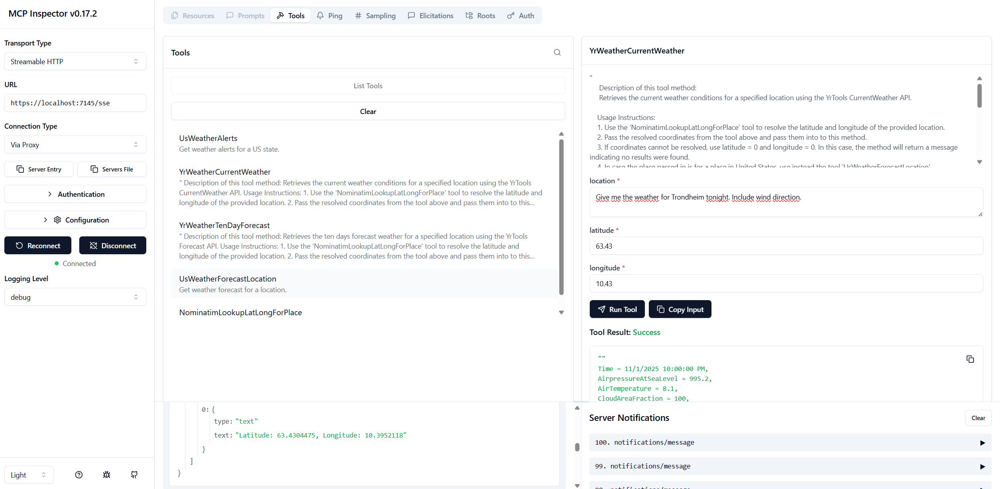
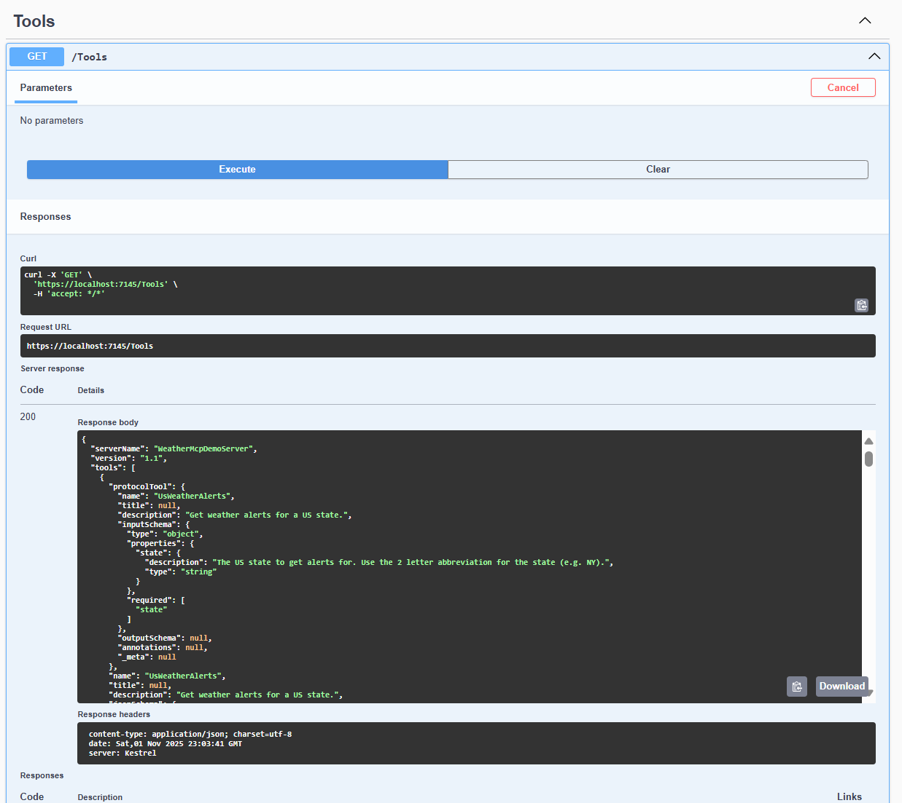

# WeatherMcpDemo

WeatherMcpDemo is a .NET 8 Razor Pages solution for retrieving, processing, and displaying weather data from multiple sources. It demonstrates modular design, extensibility, and integration with external APIs, focusing on clean separation of concerns and maintainability.


## Features

- Fetches weather data from the National Weather Service ([api.weather.gov](https://api.weather.gov))
- Supports weather alerts by state and weather forecasts for US locations
- Integrates with additional providers (Yr, Nominatim)
- Processes and formats weather information for display
- Presents results in a simple, user-friendly Razor Pages interface
- Extensible architecture for adding new weather sources
- Sample code for API client management and secrets handling

# Serverside

# WeatherMcpDemo

To set up ModelInspector in LocalDEV, first set up a self-signed certificate. 
Run the following command with sufficient priviledges to automatically set 
up such a self-signed certificate :

### Setting up self-signed certificate for the MCP server

```ps

# Variables
$certName = "WeatherMcpClientLocalDev2025"
$dnsName = "localhost"
$pfxPath = "C:\temp\$certName.pfx"
$pfxPassword = "YourStrongPassword2025!klmnpQ4xxzz"

Write-Host "Generating self-signed certificate for $dnsName..."

# 1. Create the certificate with SAN and 1-year validity
$cert = New-SelfSignedCertificate `
    -DnsName $dnsName `
    -CertStoreLocation "cert:\LocalMachine\My" `
    -Subject $certName `
    -FriendlyName $certName `
    -NotAfter (Get-Date).AddYears(1)

Write-Host "Certificate created with Thumbprint: $($cert.Thumbprint)"

# 2. Export the certificate to PFX
Write-Host "Exporting certificate to $pfxPath..."
Export-PfxCertificate `
    -Cert "cert:\LocalMachine\My\$($cert.Thumbprint)" `
    -FilePath $pfxPath `
    -Password (ConvertTo-SecureString -String $pfxPassword -Force -AsPlainText)

# 3. Import into Trusted Root Certification Authorities
Write-Host "Importing certificate into Trusted Root Certification Authorities..."

Import-PfxCertificate `
    -FilePath $pfxPath `
    -CertStoreLocation "cert:\LocalMachine\Root" `
    -Password (ConvertTo-SecureString -String $pfxPassword -Force -AsPlainText)

# 3. Import also into the My (Personal) cert store
Import-PfxCertificate `
    -FilePath $pfxPath `
    -CertStoreLocation "cert:\LocalMachine\My" `
    -Password (ConvertTo-SecureString -String $pfxPassword -Force -AsPlainText)


Write-Host "✅ Certificate '$certName' installed and trusted successfully!"
Write-Host "Use this cert in .NET Kestrel with SubjectName: $certName"
```
Afterwards, the certificate should be found by the setup code in the setup `Program.cs`.

ModelInspector expects the SSL traffic to have a valid certificate, but in LocalDEV you can use 
such a self-signed certificate.

Start the server and then start up ModelInspector.

Run this command to start ModelInspector, you will need to have Node installed with a version
that supports modern ES modules and fetch API, so at least Node version 20. I tested with 
Node version 25.

## Starting Model Inspector

To start up Model Inspector, start the project WeatherServer.Web.Http and connect
Model Inspector.

Run this command :
```ps
npx @modelcontextprotocol/inspector --startup-url "https://localhost:7145/mcp"
```
Don't worry if you havent installed ModelContextProtocol Inspector, it will be downloaded using npx tool.
You will need Node for this tool installed and Node setup in your PATH environment variable.

In case you still get trouble using SSL in LocalDev due to using self-signed certificates, run this command : 

```ps
$env:NODE_TLS_REJECT_UNAUTHORIZED=0
npx @modelcontextprotocol/inspector --startup-url "https://localhost:7145/mcp"
```
Once inside ModelContextInspector, choose 
- Transport Type set to :
Streamable HTTP
- URL set to: 
https://localhost:7145/sse
- Connection Type set to:
Via Proxy

Once ready, enter the button Connect : Connect
It should say _Connected_ with a green diode indicator.

Screenshot showing the tool in use :


Hit the button _List Tools_ to list the tools in the MCP demo.

You will get the description of each tool and by selecting a tool, you can provide its input 
parameters and also see Description / Instruction usage. 


## Getting Json-Rpc metadata from Swagger

Just start the server and Swagger shows up. Choose the Tools controller, that is endpoint
which will show the Json-RCP metadata from the MCP server.



Hit the <em>GET method</em> to get the metadata.

The Json-Rpc browser data can be browsed with a tool like <em>JsonCrack</em> online :


## Solution Structure

- `src/` - Main source code
- `Readme.md` - Project overview and instructions

## Getting Started

1. Clone the repository:
2. Open the solution in Visual Studio 2022.
3. Ensure you have the [.NET 8 SDK](https://dotnet.microsoft.com/en-us/download/dotnet/8.0) installed.
4. Restore NuGet packages.
5. Configure API keys and secrets as needed (see below).
6. Build and run the solution. The Razor Pages interface will be available at the configured URL.

## Configuration

- API keys and sensitive settings are managed using [User Secrets](https://learn.microsoft.com/en-us/aspnet/core/security/app-secrets).
- Example secrets files:
- `secrets.json` for each project requiring API keys (see `WeatherServer.Http`, `WeatherClient.Mvc`)
- Update `appsettings.json` for service endpoints and other configuration.
- See `WeatherServer.Common/Tools/` for integration points with weather APIs.

## Usage

- Access the Razor Pages interface to query weather alerts and forecasts.
- Use the chat interface (`WeatherClient.Mvc/Views/Chat/Index.cshtml`) to interact with the weather data.
- Extend the solution by adding new tools in `WeatherServer.Common/Tools/` for additional providers.

## Code Samples

### Server Example (`WeatherServer.Http/Program.cs`)

This sets up the ASP.NET Core server to serve Razor Pages and API controllers for weather data.

### Client Controller (`WeatherClient.Mvc/Controllers/ChatController.cs`)

This Razor Page displays the weather forecast returned by the controller.

## Extensibility

- Add new weather providers by implementing classes in `WeatherServer.Common/Tools/`.
- Extend controllers and views in `WeatherClient.Mvc` for custom UI or features.
- Use the modular structure to integrate other APIs or data sources.

## Requirements

- .NET 8 SDK
- Visual Studio 2022
- Internet connection for API access

## Contributing

Contributions are welcome! Please fork the repository and submit a pull request.

## License

This project is licensed under the MIT License. See the [LICENSE](LICENSE) file for details.

## Acknowledgements

- [National Weather Service API](https://api.weather.gov)
- [Yr Weather API](https://www.yr.no/)
- [Nominatim Geocoding API](https://nominatim.openstreetmap.org/)

---

**Project maintained by [toreaurstadboss](https://github.com/toreaurstadboss)**