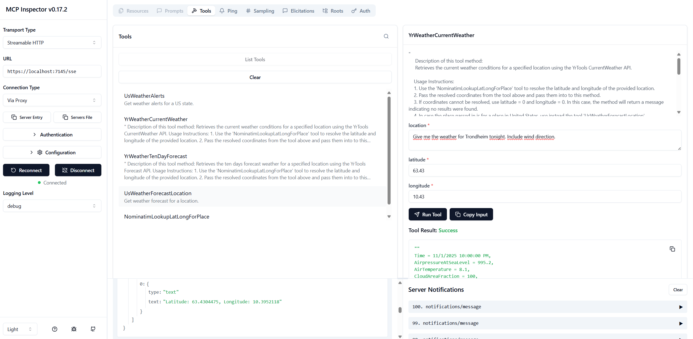
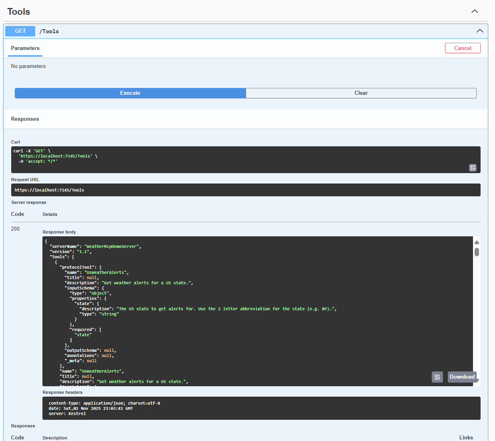
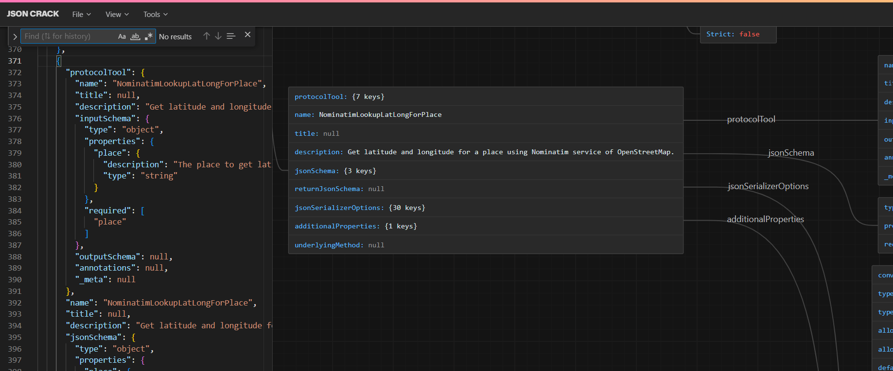

# WeatherMcpDemo

To set up ModelInspector in LocalDEV.

Start the server and then start up ModelInspector.

I have created Startup configurations called 'Web based client-server' and 'Consoel based client-server'
for easy startup of the projects needed for the demo to work.

In case you got some certificates issues over HTTPS traffic in LocalDEV, consider using Mozilla Firefox and 
add an exception. I did not come accross any issues and use Chrome Canary as the web browser 
when I test out and run the demo.


## Starting Model Inspector

To start up Model Inspector, start the project WeatherServer.Web.Http and connect
Model Inspector.

Run this command :
```ps
npx @modelcontextprotocol/inspector --startup-url "https://localhost:7145/mcp"
```
Don't worry if you havent installed ModelContextProtocol Inspector, it will be downloaded using npx tool.
You will need Node for this tool installed and Node setup in your PATH environment variable.

In case you still get trouble using SSL in LocalDev due to using self-signed certificates, run this command : 

```ps
$env:NODE_TLS_REJECT_UNAUTHORIZED=0
npx @modelcontextprotocol/inspector --startup-url "https://localhost:7145/mcp"
```
Once inside ModelContextInspector, choose 
- Transport Type set to :
Streamable HTTP
- URL set to: 
https://localhost:7145/mcp
- Connection Type set to:
Via Proxy  (if needed)

Once ready, enter the button Connect : Connect
It should say _Connected_ with a green diode indicator.

Screenshot showing the tool in use :


Hit the button _List Tools_ to list the tools in the MCP demo.

You will get the description of each tool and by selecting a tool, you can provide its input 
parameters and also see Description / Instruction usage. 


## Getting Json-Rpc metadata from Swagger

Just start the server and Swagger shows up. Choose the Tools controller, that is endpoint
which will show the Json-RCP metadata from the MCP server.



Hit the <em>GET method</em> to get the metadata.

The Json-Rpc browser data can be browsed with a tool like <em>JsonCrack</em> online :

